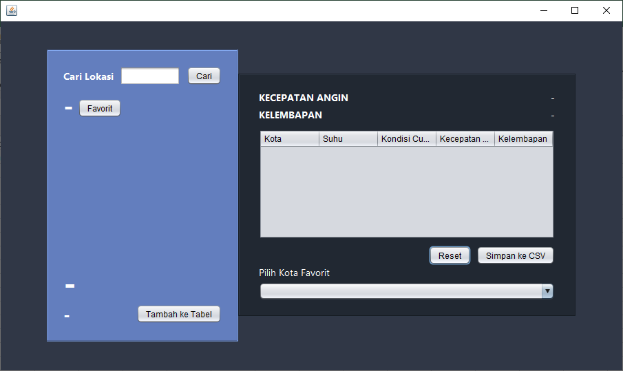
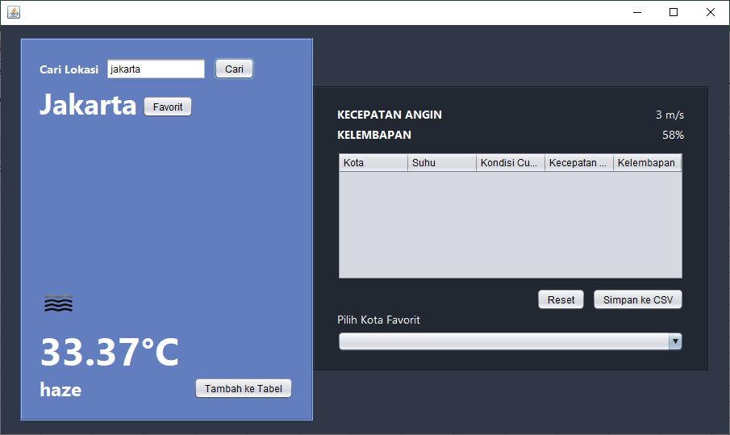
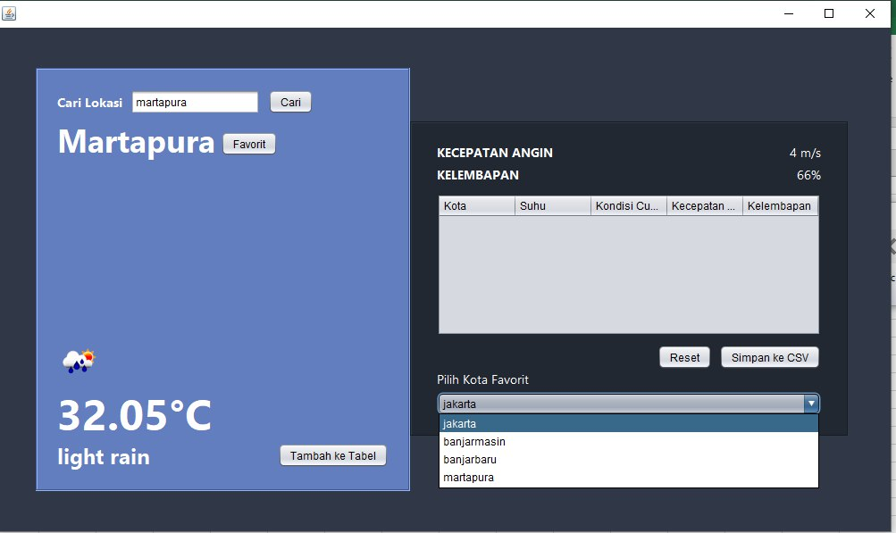
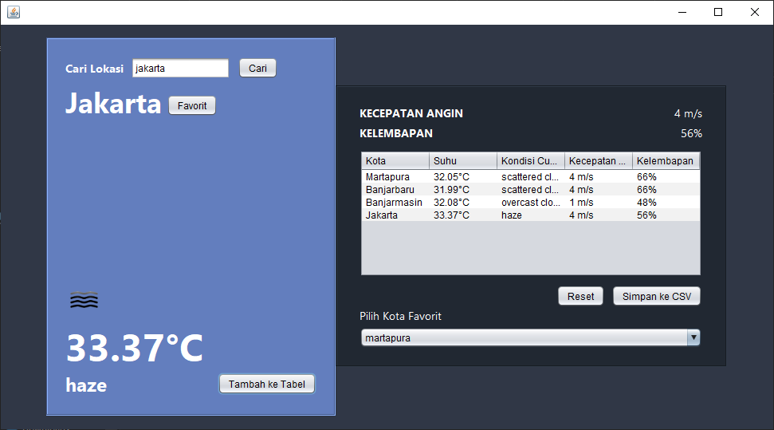
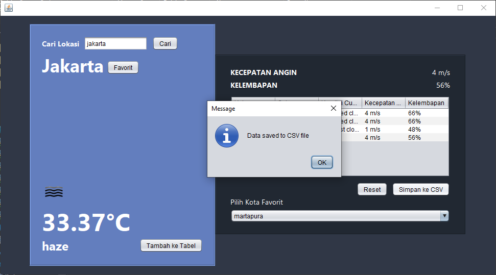
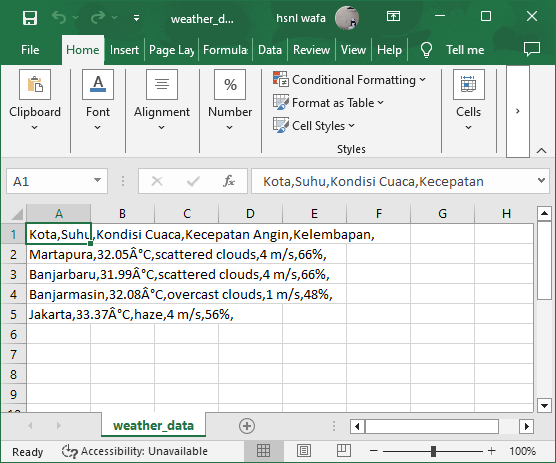

# Weather Checker App

Weather Checker App adalah aplikasi sederhana berbasis Java yang memungkinkan pengguna untuk melihat kondisi cuaca real-time di kota yang dipilih. Aplikasi ini menggunakan Swing untuk antarmuka pengguna dan mengintegrasikan API cuaca eksternal seperti OpenWeatherMap untuk mendapatkan informasi cuaca terbaru.

## Fitur Aplikasi

1. **Pencarian Cuaca Berdasarkan Kota**  
   Pengguna dapat memasukkan nama kota di kolom input dan menekan tombol "Cari" untuk mendapatkan informasi cuaca real-time. Aplikasi akan menampilkan nama kota, suhu, kondisi cuaca, kecepatan angin, dan kelembapan.

2. **Favorit Kota**  
   Pengguna dapat menambahkan kota yang sering digunakan ke daftar "Favorit" menggunakan tombol "Favorit". Kota favorit ini tersimpan di `JComboBox`, memungkinkan pengguna untuk memilih kota dari daftar favorit dan mengisi kolom input kota secara otomatis.

3. **Simpan Data ke Tabel**  
   Aplikasi memungkinkan pengguna untuk menyimpan data cuaca ke `JTable` melalui tombol "Tambah ke Tabel". Informasi yang tersimpan meliputi nama kota, suhu, kondisi cuaca, kecepatan angin, dan kelembapan.

4. **Ekspor Data Tabel ke File CSV**  
   Data yang tersimpan di `JTable` dapat diekspor ke file `.csv` menggunakan tombol "Simpan ke CSV". Data di file CSV tersusun rapi dalam kolom yang terpisah sehingga mudah dibaca di aplikasi spreadsheet.

5. **Reset Input dan Output**  
   Aplikasi menyediakan tombol "Reset" untuk menghapus input dan mengosongkan output cuaca, memungkinkan pengguna untuk melakukan pencarian baru atau membersihkan data yang ditampilkan.

## Teknologi yang Digunakan

- **Java Swing** - Untuk membangun antarmuka grafis aplikasi.
- **OpenWeatherMap API** - Untuk mendapatkan data cuaca real-time berdasarkan nama kota.
- **CSV Export** - Data di `JTable` dapat diekspor ke dalam file `.csv` untuk referensi lebih lanjut.

## Tampilan Aplikasi

- ### Tampilan awal aplikasi saat pertama kali dijalankan
  
  
- ### Mencari kota yang diinginkan dan menampilkan kondisi cuacanya
  
  
- ### Menambahkan kota yang dicari ke dalam kategori favorit
  
  
- ### Menambahkan hasil cari ke dalam table
  
 
- ### Menyimpan data yang ada di dalam table ke dalam bentuk file .csv
  

- ### hasil simpan ke file CSV
  

## Cara Penggunaan

1. **Pencarian Kota**:  
   - Masukkan nama kota di kolom `JTextField` dan klik tombol "Cari".
   - Data cuaca untuk kota yang dicari akan muncul di label, termasuk suhu, kondisi cuaca, ikon cuaca, kecepatan angin, dan kelembapan.

2. **Tambah ke Favorit**:  
   - Setelah mencari kota, pengguna dapat menekan tombol "Favorit" untuk menambahkannya ke `JComboBox` favorit.
   - Kota yang ditambahkan dapat dipilih langsung dari `JComboBox` untuk diinput ke kolom pencarian tanpa mengetik ulang.

3. **Simpan ke Tabel**:  
   - Klik "Tambah ke Tabel" untuk menyimpan data cuaca saat ini ke `JTable`.
   - Data di `JTable` dapat diakses kembali atau diekspor ke file.

4. **Ekspor ke CSV**:  
   - Klik "Simpan ke CSV" untuk mengekspor data di `JTable` ke file `.csv`.
   - File CSV akan disimpan dengan nama `weather_data.csv` dan dapat dibuka di aplikasi spreadsheet seperti Excel atau Google Sheets.

5. **Reset Data**:  
   - Gunakan tombol "Reset" untuk menghapus semua data input dan output, termasuk data di `JTextField`, `JLabel`, dan data sementara lainnya.

## Persyaratan

- **JDK** 11 atau versi lebih baru
- **NetBeans** IDE atau IDE lain yang mendukung Java Swing
- **Koneksi Internet** untuk mengakses data dari OpenWeatherMap API

## Instalasi dan Setup API

1. Buat akun di [OpenWeatherMap](https://openweathermap.org/) dan dapatkan API key.
2. Masukkan API key tersebut dalam kode untuk melakukan autentikasi saat mengambil data cuaca.
3. Pastikan memiliki koneksi internet agar aplikasi dapat mengakses API secara real-time.

## Lisensi

Aplikasi ini adalah proyek open-source dan dapat dimodifikasi atau digunakan untuk keperluan pribadi. Pastikan untuk mengikuti ketentuan dari OpenWeatherMap API jika aplikasi digunakan dalam skala komersial atau publik.

## Kontribusi

Anda dapat berkontribusi pada aplikasi ini dengan melakukan pull request atau melaporkan isu pada repository. Kontribusi berupa fitur tambahan, perbaikan bug, atau dokumentasi sangat dihargai!

